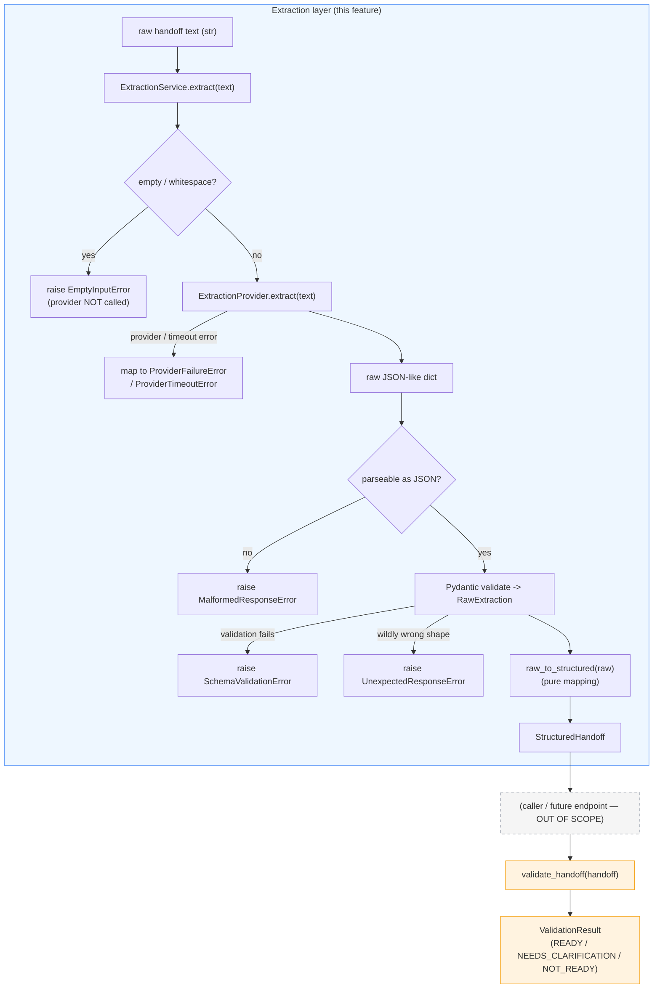

# Design Document

## Overview

This feature adds an **AI extraction layer** that turns messy, free-form handoff text into the *existing* `StructuredHandoff` domain model. It sits in front of the already-complete, already-tested deterministic core in `backend/app/domain/` and never touches that core's behavior.

The single architectural rule the design enforces is: **"AI extracts information. Deterministic code decides readiness."** The extraction layer observes and structures — it classifies each of the nine fields as PRESENT / MISSING / AMBIGUOUS / NOT_APPLICABLE, retains ambiguous values, and may declare that two fields contradict — and then stops. Its final product is a `StructuredHandoff` and nothing more. It never computes a `ReadinessState`, never calls `validate_handoff`, and never imports the validator (Req 16). Readiness is decided later, at a higher layer that is out of scope for this feature.

The design deliberately stays small enough for a solo student to read, debug, and maintain:

- One service (`ExtractionService`) that orchestrates the pipeline.
- One provider interface (`ExtractionProvider`, a `typing.Protocol`) with a single method, so fakes are trivial and the AI vendor is replaceable (Req 11, 12).
- One concrete provider (`GeminiProvider`) that talks to the Gemini REST API using the `httpx` dependency the project already has — no new heavyweight SDK (Req 11.3, 15).
- One explicit Pydantic **AI output schema** (`RawExtraction`) that validates the provider's raw output *before* any domain object is built (Req 10).
- One closed set of typed, secret-safe extraction errors (Req 14).
- A tiny env-based config module (Req 15).

No RAG, no vector DB, no ML, no fine-tuning, no multi-agent orchestration, no DB, no auth, no DI framework, no plugin system, no endpoints, and no frontend. The building blocks are `typing.Protocol` + plain classes + pure functions.

### Scope reminder

This design covers only: the extraction service, the provider abstraction, the AI output schema, the error model, the configuration, and the tests. It adds **no** API endpoints and **no** frontend, and it **does not modify** the domain core. The extraction layer *imports from* `app.domain` (it reuses `FieldCondition`, `HandoffFieldName`, `HandoffField`, `StructuredHandoff`) but never edits it.

## Architecture

The pipeline is a straight line with one hard boundary in the middle. Everything left of the boundary is *observation and structuring*; everything right of it (out of this feature's scope) is *the readiness decision*.



**The boundary (Req 16):** `ExtractionService.extract` returns a `StructuredHandoff` and stops. The dashed node and the amber nodes (`validate_handoff`, `ValidationResult`) are **not part of this feature**. No code in `app.extraction` imports `validate_handoff` or produces a `ReadinessState`. The composition `validate_handoff(service.extract(text))` happens at a future higher layer.

**Key placement decisions visible in the diagram:**

- The empty-input check happens *before* the provider is ever called (Req 1.2–1.4, 14.1).
- The provider produces *raw JSON-like data* (a decoded dict), and the **service** owns Pydantic validation. This keeps schema enforcement in exactly one place and makes fakes trivial (they just return a dict).
- Any failure short-circuits: no `StructuredHandoff` is built and `validate_handoff` is never called on a bad path (Req 10.4, 10.5).

## Module Layout

A single new package, `backend/app/extraction/`. Each module is thin and has one job. The domain package is untouched; extraction imports from it.

```
backend/app/extraction/
    __init__.py            # public API re-exports (Req 11 — one import surface)
    config.py              # env-based settings: API key name, model, timeout (Req 15)
    schema.py              # AI output schema: RawField, RawExtraction (Req 3, 4, 5, 6, 9, 10)
    errors.py              # ExtractionError base + closed set of subclasses (Req 14)
    provider.py            # ExtractionProvider Protocol (Req 11.1, 11.2, 11.4, 12)
    gemini_provider.py     # Gemini REST provider via httpx (Req 11.3, 14, 15)
    service.py             # ExtractionService orchestration + raw_to_structured (Req 1–10, 16)

backend/tests/extraction/
    __init__.py
    fakes.py               # fake/spy providers implementing the Protocol (Req 13.1)
    test_schema.py         # RawExtraction validation + enum/shape rejection (Req 3, 9, 10)
    test_service.py        # orchestration, conversion, errors, determinism (Req 1–10, 13, 14, 16)
    test_gemini_provider.py# exception/timeout mapping via injected fake transport (Req 14)
```

**Why this shape:**

- **`config.py` as its own tiny module.** Keeps the "where do settings come from" concern in one obvious file and lets the Gemini provider and tests read it without duplicating `os.environ` lookups. It is a handful of lines; folding it into `gemini_provider.py` would work too, but a separate module reads more clearly and is easier to point tests at. (Trade-off discussed in Design Decisions.)
- **`schema.py` separate from the domain model.** The AI boundary must be validated *before* the domain is constructed; keeping the raw schema in its own module makes that boundary explicit and prevents anyone from confusing "what the AI returned" with "the validated domain object" (Req 10).
- **`provider.py` (interface) separate from `gemini_provider.py` (implementation).** The service depends only on the interface (Req 11.2); the Gemini specifics are quarantined in one file so a future provider is a drop-in (Req 12.2).
- **`errors.py` separate.** A single closed set of error types the whole layer shares (Req 14.10).
- **`service.py`** holds the orchestration and the pure `raw_to_structured` mapping. It is the only module that knows the *order* of the pipeline steps.

`app/extraction/__init__.py` re-exports the public surface so callers write `from app.extraction import ExtractionService, ExtractionProvider, RawExtraction, ExtractionError, ...` — mirroring how `app.domain` re-exports its public API.

## Components and Interfaces

All snippets are Python 3.14 / Pydantic v2. Type hints use `str | list[str] | None` union syntax to match the existing domain code style.

### Configuration — `config.py` (Req 15)

A minimal, dependency-free settings reader over `os.environ`. It exposes **names**, never bakes in secrets, and provides sensible defaults for the non-secret settings.

```python
# app/extraction/config.py
import os
from dataclasses import dataclass

# Environment variable NAMES (Req 15.1, 15.3). Values live only in the
# environment / a local .env, never in source (Req 15.2).
ENV_API_KEY = "GEMINI_API_KEY"
ENV_MODEL = "GEMINI_MODEL"
ENV_TIMEOUT = "GEMINI_TIMEOUT_SECONDS"

DEFAULT_MODEL = "gemini-2.0-flash"
DEFAULT_TIMEOUT_SECONDS = 30.0


@dataclass(frozen=True)
class GeminiConfig:
    """Resolved Gemini settings, read from the environment (Req 15.1)."""

    api_key: str
    model: str
    timeout_seconds: float


def load_gemini_config() -> GeminiConfig:
    """Read Gemini settings from the environment.

    Raises a configuration error (surfaced as a ProviderFailureError by the
    provider) if the API key is absent. Never logs or echoes the key value
    (Req 14.8, 14.9, 15.2).
    """
    api_key = os.environ.get(ENV_API_KEY)
    if not api_key:
        raise MissingApiKeyError(f"Environment variable {ENV_API_KEY} is not set")
    model = os.environ.get(ENV_MODEL, DEFAULT_MODEL)
    timeout = float(os.environ.get(ENV_TIMEOUT, DEFAULT_TIMEOUT_SECONDS))
    return GeminiConfig(api_key=api_key, model=model, timeout_seconds=timeout)
```

`MissingApiKeyError` is defined in `errors.py` (a subclass of `ProviderFailureError`, see below) so a missing key surfaces as a normal, typed provider failure — it never dumps the environment or the (absent) key into a message.

> **No `pydantic-settings`.** The domain core deliberately avoided `pydantic-settings`; this module stays consistent with a plain `os.environ` read and a frozen dataclass. `pydantic-settings` is noted as an option in Design Decisions but not adopted, to keep dependencies minimal.

### AI output schema — `schema.py` (Req 3, 4, 5, 6, 9, 10)

The explicit Pydantic contract for the **provider's raw output**, distinct from the domain model. It reuses the domain enums (`FieldCondition`, `HandoffFieldName`) so any invalid condition string or invalid field name fails Pydantic validation automatically (Req 3.2, 9.4, 10.3).

```python
# app/extraction/schema.py
from pydantic import BaseModel, ConfigDict

from app.domain import FieldCondition, HandoffFieldName


class RawField(BaseModel):
    """One field as the AI reports it: a value plus exactly one condition.

    Mirrors the domain HandoffField shape but lives on the AI side of the
    boundary. Reusing FieldCondition means an out-of-vocabulary condition
    string fails validation here (Req 3.2, 10.3). A MISSING/NOT_APPLICABLE
    field may carry value=None (Req 5.1, 5.2).
    """

    value: str | list[str] | None = None
    condition: FieldCondition  # required; no default (Req 3.1)

    model_config = ConfigDict(extra="forbid")


class RawExtraction(BaseModel):
    """The full raw AI output: nine RawFields + optional declared contradictions.

    This is the AI_Output_Schema (Req 10.1). It maps 1:1 to StructuredHandoff
    but is validated FIRST, before any domain object exists (Req 10.2). Reusing
    HandoffFieldName in the contradiction pairs means a bad field name fails
    validation here (Req 9.4). extra='forbid' rejects unexpected top-level keys,
    turning "surprise" payload keys into a schema-validation failure (Req 10.3).
    """

    objective: RawField
    owner: RawField
    inputs: RawField
    expected_output: RawField
    deadline: RawField
    acceptance_criteria: RawField
    context: RawField
    constraints: RawField
    dependencies: RawField

    contradictions: list[tuple[HandoffFieldName, HandoffFieldName]] = []

    model_config = ConfigDict(extra="forbid")
```

**Why a separate schema and not the domain model directly?** The AI boundary is untrusted. Validating raw output against `RawExtraction` is *the gate*: if anything is wrong — a missing field, a wrong-typed value, a condition outside the four allowed values, a contradiction pair naming something that isn't one of the nine fields, or an unexpected extra key — Pydantic raises, the service translates that into a `SchemaValidationError`, and **no `StructuredHandoff` is built and `validate_handoff` is never called** (Req 10.3–10.5). Building the domain model directly from raw dict data would blur this gate and make it easy to accidentally construct a half-valid domain object.

**The JSON the provider is asked to return** maps 1:1 to `RawExtraction`:

```json
{
  "objective":           {"value": "Fix the login bug",              "condition": "present"},
  "owner":               {"value": null,                              "condition": "missing"},
  "inputs":              {"value": null,                              "condition": "missing"},
  "expected_output":     {"value": null,                              "condition": "missing"},
  "deadline":            {"value": null,                              "condition": "missing"},
  "acceptance_criteria": {"value": null,                              "condition": "missing"},
  "context":             {"value": null,                              "condition": "missing"},
  "constraints":         {"value": null,                              "condition": "missing"},
  "dependencies":        {"value": null,                              "condition": "missing"},
  "contradictions": []
}
```

`extra="forbid"` on both models means the shape is strict: unknown keys (at the top level or inside a field object) are rejected as schema violations rather than silently ignored, which supports the "unexpected-provider-response"/strict-schema intent (see Error Model for how this interacts with `UnexpectedResponseError`).

### Provider interface — `provider.py` (Req 11, 12)

A single-method `typing.Protocol`. The provider's job is to produce **raw JSON-like data** (a decoded Python dict) and to surface provider/timeout errors as typed extraction errors. It does **not** run Pydantic validation — the service owns that.

```python
# app/extraction/provider.py
from typing import Protocol, runtime_checkable


@runtime_checkable
class ExtractionProvider(Protocol):
    """Turns raw handoff text into raw extraction data (Req 11.1, 11.4).

    Implementations return a JSON-decoded object (a dict) that the
    ExtractionService validates against RawExtraction. Implementations are
    responsible ONLY for producing that raw data and for raising the typed
    extraction errors on provider/timeout/malformed-response conditions
    (Req 14.2, 14.3, 14.4). They MUST NOT construct a StructuredHandoff
    (Req 11.4) and MUST NOT compute readiness (Req 16).
    """

    def extract(self, text: str) -> dict:
        ...
```

**Why the provider returns a `dict` (not `RawExtraction`)?** Putting Pydantic validation in the *service* keeps schema enforcement in exactly one place (Req 10.2), makes fakes trivial (a fake just returns a literal dict — no need to know the schema), and keeps each concrete provider focused on the one thing that varies: how to talk to a vendor and how to decode its response. The provider is still responsible for turning a non-JSON body into a `MalformedResponseError` (that is a transport concern), but *schema* validity is the service's job. (Trade-off discussed in Design Decisions.)

**Fakes implement this Protocol trivially** (see Testing Strategy):

```python
class FakeProvider:
    def __init__(self, payload: dict):
        self._payload = payload
    def extract(self, text: str) -> dict:
        return self._payload
```

Because `ExtractionProvider` is a `Protocol`, `FakeProvider` needs no base class — structural typing is enough, and this satisfies Req 13.1 (run the whole pipeline with no real API call). A future real provider (e.g. a local model) is added the same way, with zero domain changes (Req 12.1).

### Gemini provider — `gemini_provider.py` (Req 11.3, 14, 15)

The initial concrete provider. It calls the Gemini REST `generateContent` endpoint with `httpx` (already a project dependency), reads config from the environment, builds the extraction prompt, decodes the JSON response into a dict, and maps every failure mode to a typed error.

```python
# app/extraction/gemini_provider.py
import json
import logging

import httpx

from app.extraction.config import GeminiConfig, load_gemini_config
from app.extraction.errors import (
    MalformedResponseError,
    ProviderFailureError,
    ProviderTimeoutError,
)

logger = logging.getLogger(__name__)

_ENDPOINT = (
    "https://generativelanguage.googleapis.com/v1beta/models/"
    "{model}:generateContent"
)


class GeminiProvider:
    """Gemini-backed ExtractionProvider (Req 11.3). Replaceable (Req 12)."""

    def __init__(self, config: GeminiConfig | None = None):
        # Config read from the environment; never hard-coded (Req 15.1, 15.2).
        self._config = config or load_gemini_config()

    def extract(self, text: str) -> dict:
        prompt = _build_prompt(text)
        url = _ENDPOINT.format(model=self._config.model)
        try:
            response = httpx.post(
                url,
                params={"key": self._config.api_key},  # key stays in params, never logged
                json={"contents": [{"parts": [{"text": prompt}]}]},
                timeout=self._config.timeout_seconds,
            )
            response.raise_for_status()
        except httpx.TimeoutException as exc:
            logger.warning("Gemini request timed out")   # no exc text, no key (Req 14.9)
            raise ProviderTimeoutError("The AI provider did not respond in time") from None
        except httpx.HTTPError as exc:
            logger.warning("Gemini request failed")       # redacted (Req 14.7, 14.9)
            raise ProviderFailureError("The AI provider request failed") from None

        # Extract the model's text part and JSON-decode it into a dict.
        try:
            text_out = response.json()["candidates"][0]["content"]["parts"][0]["text"]
            return json.loads(text_out)
        except (KeyError, IndexError, ValueError, TypeError):
            logger.warning("Gemini returned an unparseable response")
            raise MalformedResponseError(
                "The AI provider returned a response that could not be parsed"
            ) from None
```

Notes:

- **Config from env, never hard-coded** (Req 15.1, 15.2). The key is passed to `httpx` as a query param and is *never* placed in a log line or an error message.
- **The prompt encodes the extraction policy** (Req 4, 6, 7): it instructs the model to return strict JSON matching the schema (nine fields, each `{value, condition}`, plus optional `contradictions`), to use `missing` for absent information (never a guessed value), to keep the value but mark `ambiguous` when information is vague, and to use `not_applicable` only when the text supplies a cue that the field genuinely does not apply. **Prompt wording is guidance, not a guarantee** — see No-Invention Guarantees for the honest limits.
- **Every failure is mapped to a typed error with a redacted message** (Req 14.2, 14.3, 14.4, 14.7–14.9). `from None` suppresses the original exception chain so raw provider text cannot leak to the caller. Logs use fixed, safe strings — no exception text, no key.
- **`raise_for_status()` non-2xx** becomes `ProviderFailureError`; **timeouts** become `ProviderTimeoutError`; **a non-JSON / unshaped body** becomes `MalformedResponseError`. Schema validity is *not* checked here — that is the service's job.

`_build_prompt(text)` is a small pure helper returning the instruction string; its exception-mapping logic can be unit-tested by injecting a fake `httpx` transport (see Testing Strategy) without hitting the network.

### Extraction service — `service.py` (Req 1, 2, 8, 10, 16)

The orchestrator. It depends only on the `ExtractionProvider` Protocol and the domain model. It **returns a `StructuredHandoff`** — never a `ValidationResult`, and it never calls `validate_handoff` (Req 16).

```python
# app/extraction/service.py
import json

from pydantic import ValidationError

from app.domain import HandoffField, StructuredHandoff
from app.extraction.errors import (
    EmptyInputError,
    MalformedResponseError,
    SchemaValidationError,
    UnexpectedResponseError,
)
from app.extraction.provider import ExtractionProvider
from app.extraction.schema import RawExtraction, RawField


class ExtractionService:
    """Orchestrates extraction: text -> provider -> validated schema -> StructuredHandoff.

    Depends only on the ExtractionProvider interface and the domain model
    (Req 11.2). Produces a StructuredHandoff and STOPS — it does not import or
    call validate_handoff and never computes readiness (Req 16).
    """

    def __init__(self, provider: ExtractionProvider):
        self._provider = provider

    def extract(self, text: str) -> StructuredHandoff:
        # (a) Reject empty/whitespace BEFORE calling the provider (Req 1.2-1.4, 14.1).
        if text is None or not text.strip():
            raise EmptyInputError("Handoff text must not be empty")

        # (b) Call the provider. Provider/timeout/malformed errors already come
        #     back as typed ExtractionErrors; let them propagate unchanged.
        raw_data = self._provider.extract(text)

        # (c) Validate raw data against the AI output schema (Req 10.2). No
        #     repair, no guessing (Req 10.4). A non-dict body is malformed;
        #     a dict that fails Pydantic is a schema violation.
        if not isinstance(raw_data, dict):
            raise MalformedResponseError(
                "The AI provider returned data that is not a JSON object"
            )
        try:
            raw = RawExtraction.model_validate(raw_data)
        except ValidationError as exc:
            # Report the failure as a schema violation with safe, structured
            # detail derived from Pydantic (field locations + error kinds),
            # never raw provider text (Req 10.3, 14.7).
            raise SchemaValidationError.from_pydantic(exc) from None

        # (d) Convert validated raw data -> StructuredHandoff (pure) (Req 8, 10.6).
        return raw_to_structured(raw)


def raw_to_structured(raw: RawExtraction) -> StructuredHandoff:
    """Pure mapping: RawExtraction -> StructuredHandoff (Req 8, 10.6).

    Deterministic, no I/O, no inference. Builds one HandoffField(value,
    condition) per field straight from the validated raw data and passes
    contradictions through unchanged (Req 9.1). It modifies nothing: values and
    conditions are copied verbatim (Req 10.6). Constructing StructuredHandoff
    re-validates via the frozen domain models.
    """
    def field(rf: RawField) -> HandoffField:
        return HandoffField(value=rf.value, condition=rf.condition)

    return StructuredHandoff(
        objective=field(raw.objective),
        owner=field(raw.owner),
        inputs=field(raw.inputs),
        expected_output=field(raw.expected_output),
        deadline=field(raw.deadline),
        acceptance_criteria=field(raw.acceptance_criteria),
        context=field(raw.context),
        constraints=field(raw.constraints),
        dependencies=field(raw.dependencies),
        contradictions=list(raw.contradictions),
    )
```

**Orchestration order (exactly):**

1. **(a) Empty/whitespace check → `EmptyInputError`, provider not called** (Req 1.2–1.4, 14.1). `text.strip()` catches all-whitespace input (Req 1.3).
2. **(b) `provider.extract(text)`.** The provider already raises typed `ProviderFailureError` / `ProviderTimeoutError` / `MalformedResponseError`; the service lets these propagate (Req 14.2–14.4).
3. **(c) Validate into `RawExtraction`.** Non-dict → `MalformedResponseError`; Pydantic failure → `SchemaValidationError`. No repair/guess (Req 10.3, 10.4). On failure, no domain object is built and `validate_handoff` is never called (Req 10.5).
4. **(d) `raw_to_structured(raw)`** builds the `StructuredHandoff` (Req 8), passing `contradictions` through (Req 9.1). Nothing is modified (Req 10.6).
5. **Return the `StructuredHandoff`.** No readiness anywhere (Req 16).

**Why the service does not offer a "validate too" convenience.** Keeping extraction and validation separate is the whole point of Req 16. The service returns a `StructuredHandoff` only. A caller composes readiness itself with `validate_handoff(service.extract(text))` at a higher layer (documented in the Integration Boundary section). Adding a convenience that runs `validate_handoff` inside the service would put readiness logic on the extraction side of the boundary — exactly what Req 16 forbids — so we do not add it.

**`MISSING` / `NOT_APPLICABLE` value handling** (Req 4.4, 5.1–5.3): the schema already permits `value=None`, and the mapping copies it verbatim. A field the AI marks `MISSING` or `NOT_APPLICABLE` with no retained information carries `value=None` straight into the `HandoffField`. The service never fabricates a value (Req 4.1, 4.4).

### Public API — `__init__.py` (Req 11)

```python
# app/extraction/__init__.py
from app.extraction.errors import (
    EmptyInputError,
    ExtractionError,
    MalformedResponseError,
    ProviderFailureError,
    ProviderTimeoutError,
    SchemaValidationError,
    UnexpectedResponseError,
)
from app.extraction.provider import ExtractionProvider
from app.extraction.schema import RawExtraction, RawField
from app.extraction.service import ExtractionService, raw_to_structured
from app.extraction.gemini_provider import GeminiProvider

__all__ = [
    "ExtractionService",
    "raw_to_structured",
    "ExtractionProvider",
    "GeminiProvider",
    "RawExtraction",
    "RawField",
    "ExtractionError",
    "EmptyInputError",
    "ProviderFailureError",
    "ProviderTimeoutError",
    "MalformedResponseError",
    "SchemaValidationError",
    "UnexpectedResponseError",
]
```

## Data Models

Two Pydantic models on the AI side, mapping 1:1 to the existing domain model.

### `RawField` (AI side)

| Field       | Type                          | Notes |
|-------------|-------------------------------|-------|
| `value`     | `str \| list[str] \| None`    | `None` allowed for MISSING/NOT_APPLICABLE (Req 5.1, 5.2). |
| `condition` | `FieldCondition` (domain enum)| Required; reusing the enum rejects out-of-vocabulary conditions (Req 3.2, 10.3). |

`model_config = ConfigDict(extra="forbid")` — a field object with surprise keys fails validation.

### `RawExtraction` (AI side, the AI output schema)

| Field                 | Type                                                  | Notes |
|-----------------------|-------------------------------------------------------|-------|
| `objective`           | `RawField`                                            | single-valued in domain |
| `owner`               | `RawField`                                            | single-valued |
| `inputs`              | `RawField`                                            | list-valued in domain |
| `expected_output`     | `RawField`                                            | single-valued |
| `deadline`            | `RawField`                                            | single-valued |
| `acceptance_criteria` | `RawField`                                            | list-valued |
| `context`             | `RawField`                                            | single-valued |
| `constraints`         | `RawField`                                            | list-valued |
| `dependencies`        | `RawField`                                            | list-valued |
| `contradictions`      | `list[tuple[HandoffFieldName, HandoffFieldName]] = []`| default empty (Req 9.2); bad names rejected (Req 9.4). |

`model_config = ConfigDict(extra="forbid")` — unexpected top-level keys fail validation (supports strict-schema / unexpected-response intent).

> Note: the schema does not itself enforce "single-valued fields must be `str` and list-valued must be `list[str]`"; both are typed `str | list[str] | None` to mirror the domain `HandoffField`, which accepts either. The domain model is the single source of truth for that shape, and `raw_to_structured` copies verbatim into it. Requirement 8.2/8.3 describe how the fields are *represented* (str vs list vs None), which the copy preserves.

### Mapping to `StructuredHandoff` (Req 8)

`raw_to_structured` is a pure, deterministic function:

- Each `RawField` → `HandoffField(value=rf.value, condition=rf.condition)` (Req 8.4). Single-valued fields carry `str | None`; list-valued fields carry `list[str] | None` (Req 8.2, 8.3) — the value is copied unchanged.
- `raw.contradictions` → `StructuredHandoff.contradictions` unchanged (Req 9.1–9.2).
- Constructing `StructuredHandoff` re-validates through the frozen domain models, so the final object is a genuine, valid domain instance (Req 8.1). Because both raw and domain models are frozen/immutable, identical validated input yields an equal `StructuredHandoff` every time (Req 13.3).

## Error Model

All extraction errors derive from one base, `ExtractionError`, and the set is **closed** (Req 14.10). Each carries a safe, generic-but-useful message and never includes raw provider exception text, stack traces, or API credentials (Req 14.7–14.9).

```python
# app/extraction/errors.py
from pydantic import ValidationError


class ExtractionError(Exception):
    """Base for every error the extraction layer raises (Req 14)."""


class EmptyInputError(ExtractionError):
    """Input was empty or whitespace-only (Req 1.2, 1.3, 14.1)."""


class ProviderFailureError(ExtractionError):
    """The provider failed during extraction (Req 14.2)."""


class MissingApiKeyError(ProviderFailureError):
    """Required API key was not configured (Req 15.1). A provider-failure kind."""


class ProviderTimeoutError(ExtractionError):
    """The provider timed out or was unavailable (Req 14.3)."""


class MalformedResponseError(ExtractionError):
    """The provider returned a non-JSON / unparseable body (Req 14.4)."""


class SchemaValidationError(ExtractionError):
    """Raw data failed RawExtraction validation (Req 10.3, 14.5)."""

    @classmethod
    def from_pydantic(cls, exc: ValidationError) -> "SchemaValidationError":
        # Build a safe detail from Pydantic's structured errors: field
        # locations + error types only. No provider text, no secrets.
        locations = "; ".join(
            f"{'.'.join(str(p) for p in e['loc'])}: {e['type']}"
            for e in exc.errors()
        )
        return cls(f"AI output failed schema validation ({locations})")


class UnexpectedResponseError(ExtractionError):
    """The provider returned a response of an unexpected shape (Req 14.6)."""
```

### Which error for which case (Req 14.10 — exactly one, programmatically distinguishable)

| Situation | Error type | Requirement |
|-----------|------------|-------------|
| Input empty / whitespace-only (provider not called) | `EmptyInputError` | 1.2, 1.3, 14.1 |
| Provider raises during extraction (e.g. non-2xx HTTP) | `ProviderFailureError` | 14.2 |
| API key missing at provider construction | `MissingApiKeyError` (a `ProviderFailureError`) | 15.1, 14.2 |
| Provider timed out / unavailable | `ProviderTimeoutError` | 14.3 |
| Provider body is not JSON / cannot be parsed | `MalformedResponseError` | 14.4 |
| JSON parsed, but fails `RawExtraction` Pydantic validation (missing field, wrong type, bad condition, bad contradiction name, extra key) | `SchemaValidationError` | 10.3, 14.5 |
| Response shape is wildly wrong in a way not caught above (e.g. provider returns a JSON list where an object is expected, and the service chooses to classify it as an unexpected shape rather than a plain schema failure) | `UnexpectedResponseError` | 14.6 |

**Crisp distinctions (Malformed vs SchemaValidation vs Unexpected):**

- **`MalformedResponseError`** — the body is *not even JSON* / not parseable into a Python object (raised by the provider on decode failure, or by the service if it receives a non-dict).
- **`SchemaValidationError`** — the body *is* valid JSON and *is* a dict, but it violates `RawExtraction` (missing field, wrong value type, condition outside the four, contradiction pair naming a non-field, or — because `extra="forbid"` — an unexpected key). This is the common, expected validation-failure path.
- **`UnexpectedResponseError`** — reserved for shapes that are structurally surprising in a way the service explicitly classifies as "unexpected" rather than a plain field-level schema failure (for example, the top-level decoded value is a JSON array or scalar, not an object). With `extra="forbid"`, *unexpected keys* are a `SchemaValidationError`, not this. `UnexpectedResponseError` exists to complete the closed set required by Req 14.6/14.10 and to give the service a distinct code for "this doesn't even look like our contract."

**Redaction rule (Req 14.7–14.9):** whenever a caught exception is translated, the layer (a) logs a fixed, safe string (no exception text, no key), and (b) raises the typed error with `from None` so the original chain is suppressed. `SchemaValidationError.from_pydantic` derives detail only from Pydantic's *structured* error list (field path + error kind), which contains no provider free-text and no secrets.

## No-Invention Guarantees (Req 4, 6, 7)

**Honest framing:** the deterministic layer cannot *force* an LLM to never hallucinate. What this design *can* guarantee is layered, and the strongest guarantee is structural:

1. **Shape and vocabulary are constrained.** `RawExtraction` fixes the nine fields and, by reusing `FieldCondition`, restricts every condition to exactly PRESENT / MISSING / AMBIGUOUS / NOT_APPLICABLE (Req 3.1, 3.2). The AI cannot introduce a new field name (extra keys are rejected) or a new condition value.

2. **The prompt encodes the no-invention policy** (Req 4, 6, 7): mark absent information `MISSING` with `value=None` (never a guessed value); keep the value but mark `AMBIGUOUS` when it is vague; use `NOT_APPLICABLE` only when the text supplies a cue. This is *best-effort guidance* to the model, not a hard guarantee.

3. **The decisive, structural guarantee (the one that actually matters):** an invented value can never change the *readiness verdict*, because **readiness is computed solely by the deterministic `validate_handoff` from field conditions**, and the extraction layer never decides readiness (Req 16). `validate_handoff`'s issue rules key off conditions, not free-text values. So even if the model fabricated a value while (incorrectly) marking a field PRESENT, the readiness decision remains a pure function of the condition labels, made by code we fully control and test.

4. **What we can guarantee deterministically about the service itself:** the `ExtractionService` and `raw_to_structured` *add nothing*. They copy the provider's validated values and conditions verbatim into the `StructuredHandoff` (Req 10.6). Tests use fakes to assert this pass-through faithfully — a field the fake marks `MISSING` with `value=None` arrives as `MISSING`/`None`; a field marked `AMBIGUOUS` retains its value; the service introduces no external facts (Req 4.5). This is the part we *can* prove with deterministic tests, and we do.

**Limitation stated plainly:** points 1–2 reduce the *surface* for hallucination but do not eliminate model error inside a field's value. Point 3 ensures that such an error cannot corrupt the readiness decision, and point 4 ensures the extraction plumbing never adds facts of its own. That layered stance — constrain the shape, instruct the policy, and keep the decision deterministic and downstream — is the trustworthy guarantee this architecture provides.

## Integration Boundary with `validate_handoff` (Req 16)

This is the hard line the whole design is built around.

- **The service returns a `StructuredHandoff` and nothing else.** `ExtractionService.extract` has return type `StructuredHandoff` (Req 16.3).
- **No file in `app.extraction` imports `validate_handoff`, `ValidationResult`, or `ReadinessState`, and none computes or infers a readiness verdict** (Req 16.1, 16.2). This is verifiable by grep and is asserted in tests.
- **Composition happens at a higher layer, out of scope for this feature.** A future caller (e.g. an API endpoint, explicitly out of scope) writes:

  ```python
  handoff = ExtractionService(provider).extract(text)   # this feature ends here
  result = validate_handoff(handoff)                      # future higher layer (out of scope)
  ```

  This structurally enforces "AI extracts information; deterministic code decides readiness" (Req 16.4): the readiness authority (`validate_handoff`) lives entirely outside the extraction layer's import graph.

## Configuration (Req 15)

- **Source:** environment only, via `config.py` (`os.environ` read into a frozen `GeminiConfig` dataclass). No secret is hard-coded (Req 15.1, 15.2).
- **Settings:** `GEMINI_API_KEY` (required for the real provider; absence → `MissingApiKeyError`), `GEMINI_MODEL` (default `gemini-2.0-flash`), `GEMINI_TIMEOUT_SECONDS` (default `30`).
- **`.env.example`** is updated to list the **names only** (no real values, Req 15.3, 15.4):

  ```dotenv
  # AI extraction (Gemini) — required for the real provider; tests use fakes.
  GEMINI_API_KEY=
  # Optional overrides (defaults applied if unset):
  GEMINI_MODEL=
  GEMINI_TIMEOUT_SECONDS=
  ```
- **Secret hygiene:** the key is never written to a log line or an error message (Req 14.8, 14.9). It is passed only to the `httpx` request.

## Dependencies

**No new dependency is required.** The Gemini provider uses `httpx`, which the project already lists in `requirements.txt` (`httpx>=0.28`). The rest of the layer uses only the standard library (`os`, `json`, `logging`, `dataclasses`, `typing`) and Pydantic v2 (already present).

- **Chosen:** call the Gemini REST `generateContent` endpoint with `httpx`. Rationale: zero new deps, full control over the request/response, and easy to fake in tests via a custom `httpx` transport.
- **Not chosen:** the official `google-generativeai` SDK. It would add a heavyweight dependency for functionality we can achieve with one `httpx.post`. The requirements ask to add only what a Gemini provider genuinely needs; `httpx` already satisfies that. (Trade-off in Design Decisions.)

The tasks phase can therefore proceed without editing `requirements.txt`.

## Testing Strategy

Standard **pytest**, no real AI calls. The provider abstraction makes the whole pipeline testable with fakes/spies implementing the `ExtractionProvider` Protocol (Req 13.1). **Property-based testing is intentionally not used** here: this feature is I/O-boundary orchestration plus a straight-line mapping, which is best covered by targeted example and edge-case tests. (Consistent with the previous feature, which also used standard pytest.)

Tests live under `backend/tests/extraction/`. Existing domain tests (`backend/tests/domain/`) must keep passing unchanged (Req 13.5).

### Fakes and spies (`fakes.py`)

- `FakeProvider(payload: dict)` — returns a fixed dict (Req 13.1, 13.3).
- `SpyProvider` — records whether `extract` was called, to assert the provider is **not** called on empty input (Req 1.2, 14.1).
- `RaisingProvider(exc)` — raises a given typed error, to test propagation (Req 14.2–14.4).

### Test cases mapped to Req 13.2

| # | Case | Provider payload / setup | Assertion | Req |
|---|------|--------------------------|-----------|-----|
| 1 | Clear complete handoff | all nine PRESENT with values | valid `StructuredHandoff`, values copied verbatim | 2, 8, 10.6 |
| 2 | Incomplete handoff | some fields MISSING/`None` | corresponding `HandoffField`s are MISSING with `value=None` | 4.1, 4.4, 5.1 |
| 3 | Ambiguous handoff | a field AMBIGUOUS with retained value | condition AMBIGUOUS, value retained (not blanked) | 6.1, 6.4 |
| 4 | NOT_APPLICABLE fields | a field NOT_APPLICABLE, `value=None` | condition NOT_APPLICABLE, `value=None` | 5.2, 7.1 |
| 5 | No-invention (service adds nothing) | MISSING fields with `value=None` | output values equal input values field-by-field; service introduces no facts | 4.1, 4.5, 10.6 |
| 6 | Malformed provider output (non-JSON) | provider raises `MalformedResponseError`, or service gets a non-dict | `MalformedResponseError` | 14.4 |
| 7 | Invalid enum/condition | payload with `condition="urgent"` | `SchemaValidationError` | 3.2, 10.3, 14.5 |
| 8 | Invalid contradiction field name | `contradictions=[["objective","banana"]]` | `SchemaValidationError` | 9.4, 10.3 |
| 9 | Provider failure | `RaisingProvider(ProviderFailureError(...))` | `ProviderFailureError` propagates | 14.2 |
| 10 | Provider timeout | `RaisingProvider(ProviderTimeoutError(...))` | `ProviderTimeoutError` propagates | 14.3 |
| 11 | Empty input | `""` and `"   "` with `SpyProvider` | `EmptyInputError`; provider **not** called; `validate_handoff` not reachable | 1.2–1.4, 14.1 |
| 12 | Successful conversion | valid payload | returns a `StructuredHandoff` instance | 8.1 |
| 13 | Declared-contradiction conversion | `contradictions=[["deadline","constraints"]]` | pair present, unchanged, in `StructuredHandoff.contradictions` | 9.1, 9.2 |
| 14 | Determinism | same `FakeProvider` payload twice | two equal `StructuredHandoff` objects | 13.3 |
| 15 | `validate_handoff` idempotent on the result | run `validate_handoff` twice on the produced handoff | equal `ValidationResult` (composed in the *test*, not the service) | 13.4 |
| 16 | Boundary enforcement | inspect `app.extraction` imports | no import of `validate_handoff` / `ReadinessState`; return type is `StructuredHandoff` | 16.1–16.3 |
| 17 | Extra-key rejection | payload with a surprise top-level key | `SchemaValidationError` (via `extra="forbid"`) | 10.3 |

Parametrize where useful (e.g. cases 2–4 across multiple fields; empty/whitespace variants in case 11).

### Schema tests (`test_schema.py`)

Direct `RawExtraction.model_validate` tests: valid payloads pass; missing field, wrong-typed value, bad condition string, bad contradiction name, and extra keys each raise `pydantic.ValidationError` (which the service turns into `SchemaValidationError`). This isolates the gate from the orchestration (Req 3, 9, 10).

### Gemini provider tests (`test_gemini_provider.py`)

The **network path is not unit-tested against the real API.** Instead:

- Inject a fake `httpx` transport (`httpx.MockTransport`) or a client with canned responses to drive the provider's exception-mapping: a timeout → `ProviderTimeoutError`; a non-2xx status → `ProviderFailureError`; a non-JSON / wrongly-shaped body → `MalformedResponseError` (Req 14.2–14.4).
- Assert error messages contain **no** API key and **no** raw exception text (Req 14.7–14.9).
- `_build_prompt` is a pure function and can be asserted to mention the nine fields and the four conditions.
- Config tests: missing `GEMINI_API_KEY` → `MissingApiKeyError`; defaults applied when `GEMINI_MODEL` / `GEMINI_TIMEOUT_SECONDS` are unset (Req 15.1).

### Determinism and idempotence

Because the domain and raw models are frozen and `raw_to_structured` is pure, identical fake input yields equal `StructuredHandoff` objects (Req 13.3), and `validate_handoff` — composed *in the test*, never in the service — returns equal `ValidationResult`s across calls (Req 13.4). The service itself is never given a readiness responsibility.

## Design Decisions & Trade-offs

**Separate AI output schema (`RawExtraction`) vs reusing the domain `StructuredHandoff` directly.**
Chosen: a separate schema. The AI boundary is untrusted and must be validated *before* a domain object exists, so malformed AI output can never reach `validate_handoff` (Req 10.2, 10.5). A separate schema makes that gate explicit and keeps "what the AI said" clearly distinct from "the validated domain object." Reusing the domain model directly would blur the gate and make it easy to construct half-valid domain instances from raw dicts. Cost: a small amount of duplication (`RawField` mirrors `HandoffField`), accepted for the clarity and safety.

**Provider returns a raw `dict` validated by the service vs provider returns `RawExtraction`.**
Chosen: provider returns a decoded `dict`; the **service** owns Pydantic validation. This keeps schema enforcement in exactly one place (Req 10.2), makes fakes trivial (return a literal dict — no schema knowledge needed), and confines each concrete provider to the vendor-specific concern (HTTP + JSON decode + transport-error mapping). Alternative (provider returns `RawExtraction`) would spread validation across every provider and make fakes heavier. Trade-off: the provider is still responsible for non-JSON → `MalformedResponseError`, but *schema* validity is single-sourced in the service.

**`httpx` REST call vs the official Gemini SDK.**
Chosen: `httpx` against the REST `generateContent` endpoint. `httpx` is already a dependency, so this adds **no new package**, keeps full control of the request/response, and is easy to fake with `httpx.MockTransport`. The official SDK would add a heavyweight dependency for one HTTP POST. The requirements ask to add only what the provider genuinely needs; `httpx` suffices. Trade-off: we hand-roll the request/response mapping, but it is a few lines and fully under test.

**`os.environ` config vs `pydantic-settings`.**
Chosen: a minimal `os.environ` read into a frozen dataclass. The domain core deliberately avoided `pydantic-settings`; staying consistent keeps dependencies minimal and the config trivially readable. `pydantic-settings` is a reasonable option (typed settings, `.env` loading) but is not adopted here to avoid a new dependency and match the established style.

**`extra="forbid"` on the schema.**
Chosen: on both `RawField` and `RawExtraction`. Unexpected keys become schema violations rather than being silently ignored, which tightens the contract and supports the "strict schema / unexpected-response" intent (Req 10.3). Trade-off: a benign extra key from a future model version would fail validation; acceptable because the schema is our contract and we prefer explicit failure over silent drift.

**Extraction and validation kept separate (no "extract-and-validate" convenience on the service).**
Chosen: the service returns `StructuredHandoff` only and never calls `validate_handoff` (Req 16). This makes the "AI extracts, deterministic code decides" boundary structural, not merely conventional. Trade-off: callers write one extra line (`validate_handoff(service.extract(text))`); accepted, because that line lives at a higher layer that is out of scope here.

**Honest limits of the no-invention guarantee.**
Chosen: a layered stance rather than an overclaim. We constrain shape and vocabulary (schema/enums), instruct the no-invention policy (prompt), and — decisively — keep the readiness decision deterministic and downstream of extraction (Req 16). We do **not** claim to prevent an LLM from ever fabricating a value inside a field; we guarantee that such a fabrication cannot change the readiness verdict and that the extraction plumbing itself adds no facts (verified by fake-provider pass-through tests). This is the trustworthy, testable subset of "no invention" that a deterministic architecture can actually deliver.
