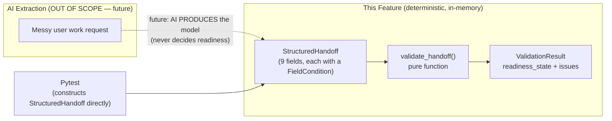

# Design Document: Core Handoff Analysis & Readiness Validation

## Overview

This feature delivers the AI-independent core of Handoff: a typed **Structured Handoff** domain model and a **deterministic Readiness Validator** that decides whether a work request is executable. It satisfies Requirements 1–8.

The guiding principle (from the requirements Introduction and Req 3.2, 3.8, 7.1) is a strict separation of concerns:

> **AI extracts information into the structured representation, but deterministic application code — never AI — decides readiness.**

Concretely, this feature builds only two of the product's stages:

1. The **Structured Handoff domain model** — the shape of an extracted work request (Req 1, 2, 6).
2. The **Readiness Validator** — a pure function that inspects a `StructuredHandoff`, produces a list of `Issue`s, and derives a `ReadinessState` (Req 3, 4, 5).

Everything runs in-memory with no AI, no network, and no external services, so it is fully testable by constructing `StructuredHandoff` instances directly in Pytest (Req 7, 8). AI extraction, clarification-question generation, the frontend, persistence, and auth are all explicitly out of scope.

### Key design stance

- **The model never invents information (Req 2.7).** A `StructuredHandoff` stores only the values it is given, each paired with a `FieldCondition` that is *supplied alongside the value*, never inferred by the model. The model does not analyze text or guess conditions — that judgment belongs to whatever produces the model (later, AI extraction).
- **Requiredness is a validator policy, not a model attribute.** The model records *what condition a field is in*; the validator decides *whether a field being absent matters*. This keeps the model a passive data container and concentrates all decision logic in one deterministic function.
- **Simplicity first (Req 8).** Plain Pydantic models and one pure function. No class hierarchies, no strategy patterns, no registries beyond a small mapping table.

## Architecture

The system is a small library within the existing `backend/app` package. There is **no API endpoint** in this feature — the validator is a plain function callable from code and tests. (A future `/api/analyze` endpoint that wraps the validator is possible but is explicitly **out of scope** and is not designed here.)



The dotted arrow marks the **seam**: AI, when it is later added, plugs in *only* to produce a `StructuredHandoff`. The validator's contract is unchanged, and readiness is always computed by deterministic code (Req 3.2).

### Module layout

A single cohesive domain package keeps related types together while separating the passive data model from the active validator:

```
backend/app/
  domain/
    __init__.py        # re-exports the public API
    handoff.py         # enums + HandoffField + StructuredHandoff (Req 1, 2)
    validation.py      # Issue + ValidationResult + issue/severity enums (Req 6)
    validator.py       # validate_handoff() pure function (Req 3, 4, 5)
backend/tests/
  domain/
    test_handoff_model.py   # model construction / condition assignment
    test_validator.py       # issue detection, severity, readiness, scenarios
```

Rationale for splitting into three small modules rather than one `models.py`: `validator.py` must import the model and enums, and keeping the pure function in its own file makes the "no I/O, no AI" boundary obvious at a glance. The two model files (`handoff.py`, `validation.py`) are deliberately thin. See *Design Decisions & Trade-offs* for the alternative considered.

## Components and Interfaces

### Enums (`app/domain/handoff.py` and `app/domain/validation.py`)

All enums are `str`-backed `enum.Enum` subclasses so they serialize cleanly and read well in test failures.

```python
class FieldCondition(str, Enum):        # Req 2.1
    PRESENT = "present"
    MISSING = "missing"
    AMBIGUOUS = "ambiguous"
    NOT_APPLICABLE = "not_applicable"

class HandoffFieldName(str, Enum):      # the nine fields (Req 1.1, 6.3)
    OBJECTIVE = "objective"
    OWNER = "owner"
    INPUTS = "inputs"
    EXPECTED_OUTPUT = "expected_output"
    DEADLINE = "deadline"
    ACCEPTANCE_CRITERIA = "acceptance_criteria"
    CONTEXT = "context"
    CONSTRAINTS = "constraints"
    DEPENDENCIES = "dependencies"

class ReadinessState(str, Enum):        # Req 3.1
    READY = "ready"
    NEEDS_CLARIFICATION = "needs_clarification"
    NOT_READY = "not_ready"

class IssueSeverity(str, Enum):         # Req 5.1
    CRITICAL = "critical"
    IMPORTANT = "important"
    MINOR = "minor"

class IssueType(str, Enum):             # detectable issue types (Req 4)
    MISSING_OBJECTIVE = "missing_objective"
    VAGUE_OBJECTIVE = "vague_objective"
    MISSING_REQUIRED_INPUT = "missing_required_input"
    MISSING_EXPECTED_OUTPUT = "missing_expected_output"
    VAGUE_DEADLINE = "vague_deadline"
    MISSING_ACCEPTANCE_CRITERIA = "missing_acceptance_criteria"
    UNRESOLVED_DEPENDENCY = "unresolved_dependency"
    CONTRADICTORY_INFORMATION = "contradictory_information"
    AMBIGUOUS_OWNERSHIP = "ambiguous_ownership"
    VAGUE_ACTION_LANGUAGE = "vague_action_language"
```

### `HandoffField` — the per-field wrapper (Req 2)

Each of the nine fields is represented by one `HandoffField` that pairs a supplied value with exactly one `FieldCondition`.

```python
class HandoffField(BaseModel):
    value: str | list[str] | None = None
    condition: FieldCondition            # required — no default (Req 2.2, 1.6)

    model_config = ConfigDict(frozen=True)  # immutable => safe to validate repeatedly
```

- **Exactly one condition per field (Req 1.2, 2.2).** `condition` has no default, so constructing a `HandoffField` without a valid `FieldCondition` raises `ValidationError` (Req 1.6).
- **`MISSING` vs `NOT_APPLICABLE` are distinct (Req 2.4, 2.6).** Both typically carry `value=None`, but they are different enum members. `MISSING` = "not supplied but relevant"; `NOT_APPLICABLE` = "legitimately irrelevant". The validator treats them very differently (see false-positive guards). They are never conflated because the discriminator is the `condition`, not the emptiness of the value.
- **Never invents information (Req 2.7).** `HandoffField` stores only what it is handed. There is no code path that populates `value` from anything other than the constructor argument, and `condition` is always supplied by the caller — the model performs no inference. If nothing is supplied for a field, the caller must still state a condition (`MISSING` or `NOT_APPLICABLE`); the model will not choose one.

`value` accepts `str` for single-valued fields, `list[str]` for list-valued fields, or `None`. Type violations raise `ValidationError` (Req 1.5).

### `StructuredHandoff` — the domain model (Req 1)

```python
class StructuredHandoff(BaseModel):
    objective: HandoffField
    owner: HandoffField
    inputs: HandoffField              # naturally list-valued
    expected_output: HandoffField
    deadline: HandoffField
    acceptance_criteria: HandoffField # naturally list-valued
    context: HandoffField
    constraints: HandoffField         # naturally list-valued
    dependencies: HandoffField        # naturally list-valued

    # Optional, explicitly declared contradictions between two fields.
    # Deterministic input to contradiction detection — see Deterministic Rules.
    contradictions: list[tuple[HandoffFieldName, HandoffFieldName]] = []

    model_config = ConfigDict(frozen=True)
```

- **Exactly nine fields, each a `HandoffField` (Req 1.1).** All nine are required *fields of the model*; each therefore always carries exactly one condition (Req 1.2, 2.2). "Required per model" is separate from "required for the task" — the latter is a validator policy.
- **Single-valued vs list-valued.** `objective`, `owner`, `expected_output`, `deadline`, `context` are conceptually single strings; `inputs`, `acceptance_criteria`, `constraints`, `dependencies` are naturally lists. `HandoffField.value` permits both, so the model stays simple and does not need nine bespoke field types. Callers/tests populate the appropriate shape.
- **Constructible with no AI/network (Req 1.7).** Pure Pydantic construction.
- **Invalid construction raises, no partial instance (Req 1.5).** Pydantic validates all fields before returning an instance.
- **`contradictions`** is the deterministic, testable mechanism for Req 4.8 (detailed below). Default empty list means "no declared contradictions".

### `Issue` and `ValidationResult` (`app/domain/validation.py`, Req 6)

```python
class Issue(BaseModel):
    issue_type: IssueType
    severity: IssueSeverity
    field: HandoffFieldName                       # the associated field (Req 6.3)
    secondary_field: HandoffFieldName | None = None  # for contradictions (Req 4.8)
    explanation: str                              # human-readable (Req 6.3)

class ValidationResult(BaseModel):
    readiness_state: ReadinessState               # Req 6.1
    issues: list[Issue]                           # Req 6.2
```

- Each `Issue` carries a severity, an associated field, and a human-readable explanation (Req 6.3).
- `secondary_field` is populated **only** for `CONTRADICTORY_INFORMATION`, letting one issue reference the two conflicting fields (Req 4.8) without a separate model.
- `ValidationResult` holds the readiness verdict and the full issue list (Req 6.1, 6.2). No boolean; consumers get the verdict plus specifics.
- Both are Pydantic models in the `backend/app` package (Req 6.5).
- There is **no error-indication field** in `ValidationResult`. Construction errors are surfaced as Pydantic `ValidationError` at model-build time (Req 1.5), consistent with the requirements' scoping decision.

### The validator (`app/domain/validator.py`, Req 3, 4, 5)

```python
def validate_handoff(handoff: StructuredHandoff) -> ValidationResult:
    """Deterministically decide readiness. Pure: no I/O, no AI, no network."""
```

A single pure function. Given identical input it always returns an equal result (Req 3.7, 4.13). Internally it: (1) applies the required-fields policy, (2) runs the issue-detection rules, (3) reduces the issue list to a `ReadinessState`.

## Data Models

Summary of the shapes (all Pydantic v2 `BaseModel`, all frozen):

| Model | Fields | Purpose | Requirements |
|---|---|---|---|
| `HandoffField` | `value: str \| list[str] \| None`, `condition: FieldCondition` | Pair one supplied value with one condition | 1.2, 2.2–2.7 |
| `StructuredHandoff` | nine `HandoffField`s + `contradictions` | The structured work request | 1.1–1.7 |
| `Issue` | `issue_type`, `severity`, `field`, `secondary_field?`, `explanation` | One detected problem | 6.3, 4.8 |
| `ValidationResult` | `readiness_state`, `issues` | The validator's output | 6.1–6.5 |

Enums: `FieldCondition` (4 values), `HandoffFieldName` (9), `ReadinessState` (3), `IssueSeverity` (3), `IssueType` (10).

## Deterministic Rules

### Required-fields policy (no AI — Req 4.3, 4.6, 4.9, 4.11, 4.12)

The validator decides requiredness with a fixed, deterministic policy. `NOT_APPLICABLE` is the explicit caller signal that a field is not required; it always short-circuits any missing-information issue for that field (Req 4.11).

| Field | Requiredness policy |
|---|---|
| `objective` | **Always required** (core of any handoff) |
| `expected_output` | **Always required** |
| `inputs` | Required **unless** `NOT_APPLICABLE` |
| `owner` | Required **unless** `NOT_APPLICABLE` |
| `acceptance_criteria` | Required **unless** `NOT_APPLICABLE` |
| `dependencies` | Required **unless** `NOT_APPLICABLE` |
| `deadline`, `context`, `constraints` | Optional (never required); only produce issues when `AMBIGUOUS` where a rule applies |

The rule is intentionally simple: **a field is required if it is in the "always required" set, or if it is not marked `NOT_APPLICABLE` and belongs to the "required-unless-NA" set.** This makes `NOT_APPLICABLE` the single deterministic lever a caller uses to say "this field genuinely does not apply" (e.g., a solo operational task with `owner = NOT_APPLICABLE`, or a task with no `dependencies = NOT_APPLICABLE`). It directly implements the two false-positive guards:

- **Req 4.11:** `NOT_APPLICABLE` never yields a missing-information issue.
- **Req 4.12:** a non-required field in `MISSING` never yields a `CRITICAL` issue solely for being absent.

### Issue-detection rules: `(field, condition)` → `(IssueType, IssueSeverity)`

Each row fires **exactly one** issue when its trigger holds (satisfying the "exactly one Issue" clauses in Req 4.1–4.10):

| # | Trigger (field, condition) | Issue type | Severity | Req |
|---|---|---|---|---|
| 1 | `objective` = MISSING | `missing_objective` | CRITICAL | 4.1 |
| 2 | `objective` = AMBIGUOUS | `vague_objective` | IMPORTANT | 4.2 |
| 3 | `inputs` = MISSING **and required** | `missing_required_input` | CRITICAL | 4.3 |
| 4 | `expected_output` = MISSING | `missing_expected_output` | CRITICAL | 4.4 |
| 5 | `deadline` = AMBIGUOUS | `vague_deadline` | IMPORTANT | 4.5 |
| 6 | `acceptance_criteria` = MISSING **and required** | `missing_acceptance_criteria` | IMPORTANT | 4.6 |
| 7 | `dependencies` = MISSING **or** AMBIGUOUS **and required** | `unresolved_dependency` | IMPORTANT | 4.7 |
| 8 | declared contradiction between two fields | `contradictory_information` | CRITICAL | 4.8 |
| 9 | `owner` = MISSING **or** AMBIGUOUS **and required** | `ambiguous_ownership` | IMPORTANT | 4.9 |
| 10 | `objective` or `expected_output` = AMBIGUOUS | `vague_action_language` | MINOR | 4.10 |

Notes on overlaps and severity choices:

- **Rule 2 and Rule 10 can co-fire on `objective`** when it is AMBIGUOUS: a `vague_objective` (IMPORTANT) *and* a `vague_action_language` (MINOR). Both are distinct issue types the requirements name separately (Req 4.2 vs 4.10); the requirements say "exactly one Issue" *of each named type*, which is preserved. `vague_action_language` is MINOR so it never changes the readiness verdict on its own (Req 5.4, 5.5).
- **Critical vs Important split (Req 5.2–5.4):** `CRITICAL` is reserved for information *essential to execution* — you cannot do the work without an objective, an expected output, a required input, or in the face of a genuine contradiction. `IMPORTANT` covers defects that should be clarified but do not by themselves block execution — a vague deadline, missing acceptance criteria, an unresolved dependency, unclear ownership, or a vague objective (you can still attempt the work). `MINOR` (`vague_action_language`) is a low-impact stylistic observation.
- **False-positive guards apply before rules fire:** rules 3, 6, 7, 9 only fire when the field is *required* per policy; a `NOT_APPLICABLE` field is skipped entirely (Req 4.11), and a non-required `MISSING` field never produces a `CRITICAL` (Req 4.12).

### Contradiction detection (Req 4.8) — deterministic, no NLP

Deep semantic contradiction detection would require NLP/AI and is **explicitly out of scope**. Instead the validator uses a simple, fully deterministic and testable rule:

> The `StructuredHandoff` carries an optional `contradictions` list of explicit `(field_a, field_b)` pairs. For each declared pair, the validator emits exactly one `contradictory_information` issue (CRITICAL) whose `field` and `secondary_field` are the two named fields.

This keeps contradiction detection honest and testable: the producer of the model (a human in tests, or AI later) declares that two fields conflict, and the deterministic validator faithfully reports it. **Limitation (documented explicitly):** the validator does not *discover* contradictions from raw natural language; it only reports declared ones. Contradiction information will eventually be supplied by an upstream extraction layer (out of scope here) that populates the `contradictions` list; the validator's contract is unchanged. This is the intended trade-off for a solo-student-maintainable, AI-free core.

### Readiness derivation (Req 3.3–3.7)

Exact deterministic reduction from the issue list:

```
if any issue.severity == CRITICAL:      readiness = NOT_READY
elif any issue.severity == IMPORTANT:   readiness = NEEDS_CLARIFICATION
else:                                   readiness = READY   # only MINOR, or empty
```

| Issue set | Readiness | Req |
|---|---|---|
| contains ≥1 CRITICAL | NOT_READY | 3.3 |
| no CRITICAL, ≥1 IMPORTANT | NEEDS_CLARIFICATION | 3.4 |
| no CRITICAL, no IMPORTANT (any MINOR count) | READY | 3.5 |
| empty | READY | 3.6 |

The function is a pure function of its input, so repeated validation is **idempotent/deterministic** — identical input always yields an identical `ValidationResult` (Req 3.7, 4.13). Frozen models reinforce that inputs cannot mutate between runs.

## Worked Examples

Field notation: `P`=PRESENT, `M`=MISSING, `A`=AMBIGUOUS, `NA`=NOT_APPLICABLE. Order: objective, owner, inputs, expected_output, deadline, acceptance_criteria, context, constraints, dependencies.

### Example 1 — Clearly executable handoff → READY (Req 7.3)

| Field | Condition |
|---|---|
| objective | P |
| owner | P |
| inputs | P |
| expected_output | P |
| deadline | P |
| acceptance_criteria | P |
| context | P |
| constraints | NA |
| dependencies | NA |

**Issues:** none. **Readiness:** `READY` (Req 3.6). `constraints`/`dependencies` are `NOT_APPLICABLE`, so no issue (Req 4.11).

### Example 2 — Missing critical info → NOT_READY (Req 7.4)

| Field | Condition |
|---|---|
| objective | **M** |
| owner | P |
| inputs | P |
| expected_output | **M** |
| deadline | P |
| acceptance_criteria | P |
| context | P |
| constraints | NA |
| dependencies | NA |

**Issues:** `missing_objective` (CRITICAL, objective), `missing_expected_output` (CRITICAL, expected_output). **Readiness:** `NOT_READY` (Req 3.3).

### Example 3 — Mostly complete, a few questions → NEEDS_CLARIFICATION (Req 7.5)

| Field | Condition |
|---|---|
| objective | P |
| owner | P |
| inputs | P |
| expected_output | P |
| deadline | **A** |
| acceptance_criteria | **M** (required) |
| context | P |
| constraints | NA |
| dependencies | NA |

**Issues:** `vague_deadline` (IMPORTANT, deadline), `missing_acceptance_criteria` (IMPORTANT, acceptance_criteria). No CRITICAL. **Readiness:** `NEEDS_CLARIFICATION` (Req 3.4).

### Example 4 — Vague software-development request (Req 7.6)

Request: "make the app better." Objective and expected output are supplied but unclear.

| Field | Condition |
|---|---|
| objective | **A** |
| owner | P |
| inputs | P |
| expected_output | **A** |
| deadline | NA |
| acceptance_criteria | **M** (required) |
| context | P |
| constraints | NA |
| dependencies | NA |

**Issues:** `vague_objective` (IMPORTANT, objective), `vague_action_language` (MINOR, objective), `vague_action_language` (MINOR, expected_output), `missing_acceptance_criteria` (IMPORTANT, acceptance_criteria). No CRITICAL. **Readiness:** `NEEDS_CLARIFICATION` (Req 3.4). Shows Rule 2 and Rule 10 co-firing on `objective`.

### Example 5 — University assignment/task handoff (Req 7.7)

A student assignment: acceptance criteria (grading rubric) matter; there is no separate "owner" because the student is the doer.

| Field | Condition |
|---|---|
| objective | P |
| owner | **NA** |
| inputs | P |
| expected_output | P |
| deadline | P |
| acceptance_criteria | P |
| context | P |
| constraints | P |
| dependencies | NA |

**Issues:** none. **Readiness:** `READY`. **False-positive guard demonstrated:** `owner = NOT_APPLICABLE` and `dependencies = NOT_APPLICABLE` produce **no** issues (Req 4.11, 7.10).

### Example 6 — Small-business operational task (Req 7.8)

"Restock the front-of-shop display before opening." A solo operator; no dependencies.

| Field | Condition |
|---|---|
| objective | P |
| owner | **NA** |
| inputs | P |
| expected_output | P |
| deadline | P |
| acceptance_criteria | **NA** |
| context | P |
| constraints | P |
| dependencies | **NA** |

**Issues:** none. **Readiness:** `READY`. **False-positive guard demonstrated:** `dependencies = NOT_APPLICABLE` (and `owner`, `acceptance_criteria`) produce **no** issues (Req 4.11, 7.10).

### Example 7 — Contradictory information → NOT_READY (Req 7.9)

Deadline says "today" but a dependency says "after the vendor delivers next week." The producer declares a contradiction between `deadline` and `dependencies`.

| Field | Condition |
|---|---|
| objective | P |
| owner | P |
| inputs | P |
| expected_output | P |
| deadline | P |
| acceptance_criteria | P |
| context | P |
| constraints | NA |
| dependencies | P |

`contradictions = [(deadline, dependencies)]`

**Issues:** `contradictory_information` (CRITICAL, field=deadline, secondary_field=dependencies). **Readiness:** `NOT_READY` (Req 3.3, 4.8).

## Error Handling

- **Invalid construction (Req 1.5, 1.6):** passing an invalid `FieldCondition`, a wrong value type, or omitting a field's condition raises Pydantic `ValidationError`. No partially constructed instance is produced. Callers/tests are expected to catch `ValidationError`.
- **No error object in `ValidationResult`:** per the requirements' scoping decision, the validator does not model construction errors as issues. If a `StructuredHandoff` exists, it is well-formed, and the validator only reports readiness issues.
- **Empty issue list → READY (Req 3.6, 6.4):** a fully clear handoff (or one whose optional fields are all `NOT_APPLICABLE`) yields an empty issue list and `readiness_state = READY`.
- **All-`NOT_APPLICABLE` optional fields → no false issues (Req 4.11):** the required-fields policy skips `NOT_APPLICABLE` fields, so they never generate issues.
- **The validator never raises for a valid `StructuredHandoff`:** it is total over well-formed inputs and always returns a `ValidationResult`.

## Testing Strategy

All tests are standard **Pytest**, run fully offline with no AI, network, or external services (Req 7.1, 8.2). Tests construct `StructuredHandoff` instances directly (Req 7.2). No extra testing dependency is required — the existing Pytest setup is sufficient. Where a single behavior should hold across many concrete inputs (the issue-detection mappings, the readiness reduction), we use `@pytest.mark.parametrize` to cover representative cases in one compact, readable test rather than repeating near-identical test bodies.

### Model tests (`tests/domain/test_handoff_model.py`)

- **Construction succeeds** for valid `value`+`condition` combinations, and reading a `HandoffField` back yields the identical value and condition — confirming the model never invents or alters supplied content (Req 1.4, 2.7).
- **Construction fails** with Pydantic `ValidationError` (and produces no instance) for invalid input — an invalid `FieldCondition`, a wrong `value` type, or an omitted condition. Parametrized with one case per field for the omitted-condition case, plus cases for invalid condition and wrong value type (Req 1.5, 1.6).
- **Enum shape:** `FieldCondition` has exactly the four members and `HandoffFieldName` has exactly nine (Req 2.1, 1.1).
- **`NOT_APPLICABLE` and `MISSING` are distinct** and both storable with `value=None` (Req 2.4, 2.6).

### Validator tests (`tests/domain/test_validator.py`)

- **Issue-detection rules — one parametrized test** mapping each triggering `(field, condition)` to its expected `(IssueType, field, IssueSeverity)`, covering the ten rows of the issue-detection table. Each case constructs a minimal triggering `StructuredHandoff` and asserts the produced issue exists exactly once with the expected type, associated field, and severity (Req 4.1–4.10, 5.2–5.4). This single parametrized test replaces what would otherwise be ten near-duplicate tests and captures the intent of the per-rule invariants.
- **Readiness reduction — one parametrized test** over representative issue sets asserting the exact reduction: any `CRITICAL` → `NOT_READY`; else any `IMPORTANT` → `NEEDS_CLARIFICATION`; else (only `MINOR`, or none) → `READY`; an empty issue set → `READY` (Req 3.3–3.6, 5.5).
- **False-positive guards** (two explicit tests capturing the intent of the guard invariants):
  - A field set to `NOT_APPLICABLE` never yields a missing-information issue (`missing_*`, `unresolved_dependency`, `ambiguous_ownership`) for that field (Req 4.11, 7.10).
  - A non-required field in condition `MISSING` never yields a `CRITICAL` issue solely for being absent (Req 4.12).
- **Idempotence — a plain assert-equal test:** validating the same `StructuredHandoff` twice yields two equal `ValidationResult`s (same readiness state and same issues). This is a direct equality assertion, not a randomized test (Req 3.7, 4.13).
- **Declared contradiction:** a handoff carrying a declared `(field_a, field_b)` pair yields exactly one `contradictory_information` issue (CRITICAL) whose `field` and `secondary_field` are those two fields (Req 4.8, 5.2).
- **Issue structure:** every produced issue carries a valid severity from `{CRITICAL, IMPORTANT, MINOR}`, an associated field, and a non-empty explanation (Req 5.1, 6.3).
- **The seven worked-example scenarios** (Examples 1–7 above), one test each, asserting the documented issues and readiness verdict (Req 7.3–7.9).
- **Empty issue list → READY** with an empty `issues` list (Req 3.6, 6.4).
- **Model placement:** `ValidationResult` and its related models are Pydantic `BaseModel` subclasses in the `app` package — a simple structural assertion (Req 6.5).

### Coverage rationale

Parametrized tests carry the breadth (all issue-detection rows, all readiness transitions) in a few compact tests, while dedicated tests document the false-positive guards, idempotence, contradiction reporting, and the seven required scenarios. Together they cover every issue-detection rule, the full readiness reduction, and each documented edge case without redundant near-duplicate test bodies.

## Design Decisions & Trade-offs

- **Three small domain modules vs one `models.py`.** Considered a single `app/domain/models.py`. Chose `handoff.py` + `validation.py` + `validator.py` so the pure, AI-free validator is visibly isolated in its own file and the passive data models are separated from the active decision logic. The files stay thin, so this adds clarity without meaningful complexity. Either is acceptable under Req 8; if the student prefers fewer files, collapsing the two model files into one is a safe simplification.
- **Requiredness lives in the validator, not the model (Req 4, 8).** The model only records each field's condition; the validator applies a fixed policy (always-required set + required-unless-`NOT_APPLICABLE` set). This keeps the model a passive, "never invent" data container (Req 2.7) and concentrates all decisions in one deterministic, testable function (Req 3.2).
- **`NOT_APPLICABLE` as the single deterministic requiredness lever.** Rather than a separate per-task configuration object, the caller communicates "this field does not apply" by setting `NOT_APPLICABLE`. This is simple, explicit, and directly powers the false-positive guards (Req 4.11, 4.12).
- **Contradiction detection is declared, not discovered (Req 4.8) — explicit limitation.** The validator reports only contradictions explicitly declared on the model (`contradictions` list). It does **not** infer contradictions from field text, because that would require NLP/AI, which is out of scope and would make the rule non-deterministic and hard to test. This is a deliberate trade-off favoring determinism, testability, and simplicity for a solo student. When AI extraction is added later, it can populate `contradictions`; the validator's contract does not change.
- **`HandoffField.value` is a union (`str | list[str] | None`) rather than nine bespoke types.** Keeps the model minimal (Req 8.4) while still expressing that some fields are naturally list-valued.
- **Frozen models.** Immutability makes repeated validation trivially deterministic (Req 3.7, 4.13) and prevents accidental mutation between runs.
- **No API endpoint.** This feature is a library. A future `/api/analyze` route wrapping `validate_handoff` is possible but explicitly out of scope and intentionally not designed here.
